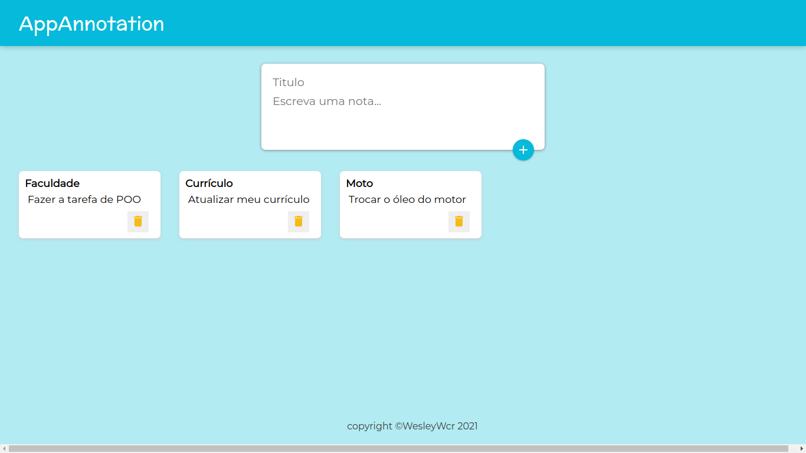

<p align="center">


</p>

<h1 align="center"> <strong>📝 AppAnnotation</strong></h1>

<h1 align="center">
     

</h1>

# 📕 About

📝 Note-taking application.

# 📌 Table of Contents

- [🛠️Technologies](#---technologies)
- [🚀Features](#--features)
- [🏃Getting Started](#--getting-started)
- [📝License](#--license)

# 🛠️Technologies

This project was made using the follow technologies:

- [React](https://reactjs.org)
- [JavaScript](hhttps://developer.mozilla.org/pt-BR/docs/Web/JavaScript)

# 🏃Getting Started

```sh
#  Clone Repository
$ git clone https://github.com/wesleywcr/AppAnnotation.git
```

```sh
# Install Dependencies
$ npm install
# Run Web aplication
$ npm start


```

# 📝License

Released in 2021.
This project is under the [MIT license](./LICENSE)
Made with ❤️ by [Wesley Rodrigues](https://github.com/wesleywcr)🤙👊
